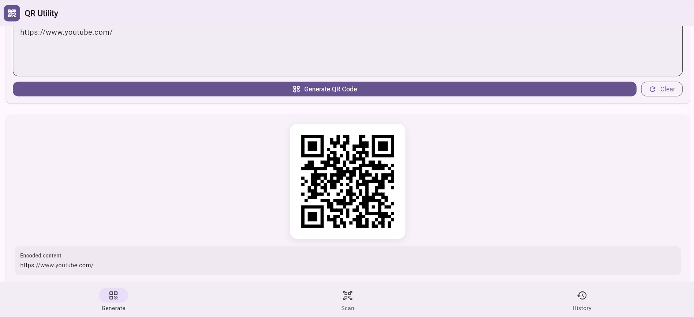
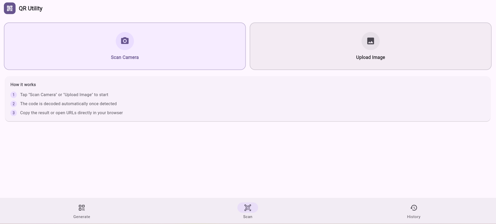

# QR Utility App

A simple and modern Flutter web app to generate, scan, save, and manage QR codes.

<p align="center">
  <a href="https://qr-utility-app-g1y3.vercel.app/" target="_blank">
    
  </a>
</p>

---

## Screenshots

### Home / Generate QR


### Scan QR


### History


---

## Features

- Generate QR codes from text or URLs
- Scan QR codes using camera
- Scan QR codes from uploaded images
- Copy scanned or generated text
- Open scanned URLs directly
- Share generated QR code
- Save generated and scanned QR codes in history
- Delete history items
- Clear all history
- Clean responsive UI

---

## Tech Stack

- Flutter
- Dart
- qr_flutter
- mobile_scanner
- shared_preferences
- image_picker
- url_launcher
- share_plus
- zxing2

---

## Run Locally

```bash
git clone https://github.com/mishita27twr/qr-utility-app.git
cd qr-utility-app/qr_utility_app
flutter pub get
flutter run
```

---

## Build for Web

```bash
flutter build web --release
```

---

## Author

**Mishita Tiwari**  
B.Tech CSE (AI/ML), VIT Bhopal University
GitHub: https://github.com/mishita27twr

If you found this project helpful, consider giving it a ⭐ on GitHub.